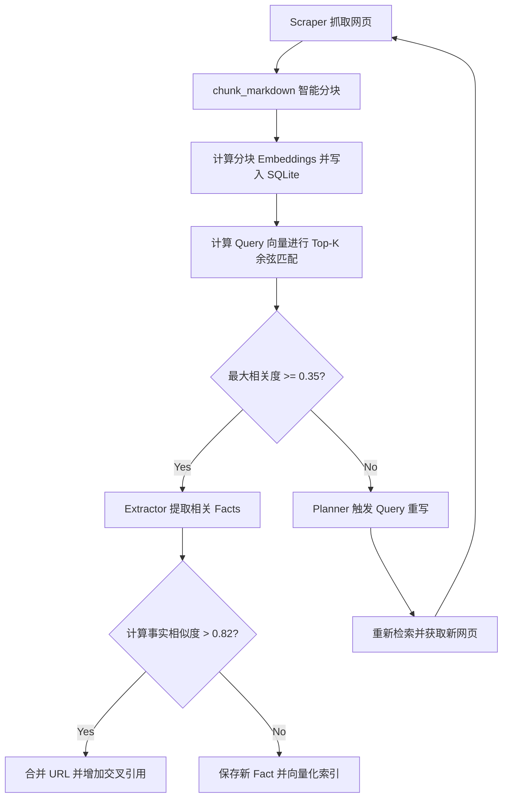

# Agentic RAG（智能体检索增强生成）设计与实现说明书

本篇设计文档记录了为“自动化深度研究智能体”引入 **Agentic RAG** 架构的设计决策、核心模块划分、流程图及具体的改动关键。

---

## 1. 架构设计与背景

在原先的单向递归循环中，系统抓取到网页后，会将整个网页直接送入 Extractor 进行提取，最后将所有 Facts 拼接送入 Synthesizer 生成报告。这导致了三个痛点：
1. **API Token 费用昂贵**：直接处理整页长文消耗大量 Token。
2. **字面去重不准**：采用 Jaccard 语法级别去重，无法合并意思相近但用词不同的事实节点。
3. **上下文限制**：一次性将全部事实输入 Synthesizer 容易超出模型的上下文窗口，并导致模型“迷失在中间”。

**Agentic RAG** 引入了本地向量检索（SQLiteVectorStore）、智能网页分块（Smart Chunking）、语义去重、主动纠错检索（Corrective RAG）以及分章节检索增强生成（Chapter Synthesis），有效解决了上述问题。

---

## 2. 核心工作流程



---

## 3. 关键组件与改动记录

### 3.1 向量存储与嵌入基础设施 (`app/utils/vector_store.py`)
* **本地化免依赖实现**：实现了 `SQLiteVectorStore` 向量库，利用 Python 的 `math` 库在内存中进行余弦相似度计算，避开了复杂的编译依赖（如 NumPy、Qdrant-client），性能可完美支撑单任务几千个分块的计算（检索时间 <10ms）。
* **数据库表定义**：
  ```sql
  CREATE TABLE document_embeddings (
      id TEXT PRIMARY KEY,
      task_id TEXT NOT NULL,
      text TEXT NOT NULL,
      embedding TEXT NOT NULL, -- JSON List[float]
      metadata TEXT NOT NULL   -- JSON dict (含 url, title, type 等)
  );
  ```
* **文档分块**：实现 `chunk_markdown`，在尽量保留段落边界（以双换行 `\n\n` 优先分割）的前提下，将网页切分为包含重叠度（Overlap）的文本片段。

### 3.2 智能检索过滤与语义去重 (`app/core/loop.py`)
* **Top-K 片段召回**：在 `scrape_and_extract_facts` 中，将抓取的页面内容分块并调用 `get_embeddings` 计算向量后存入数据库。之后，利用当前子方向查询词（Query）的向量与这些分块向量进行余弦排序，只取 Top-K 且相关度 $\ge 0.35$ 的块组合传递给 Extractor，大幅减少输入 Token 消耗。
* **基于 Embedding 缓存的语义去重**：提取事实后，利用向量相似度判定去重。若相似度大于 0.82，判定为重复事实，合并其 `evidence` 并增加交叉引用；否则作为新事实入库并进行向量化。在内存中对已提取的事实进行 Embedding 缓存，避免重复请求向量接口。

### 3.3 检索评估与主动纠错 (Corrective RAG)
* **最大相关度校验**：若某个查询词在抓取的页面中算出的最大余弦相似度低于相关度阈值（0.35），则判定该查询无效，放弃进行事实提取。
* **主动重构查询**：在 `explore_single_topic` 主循环中，如果该次查询未提取到任何相关事实，智能体将调用 `PlannerAgent.rewrite_query` 生成替代查询词（Query Rewriting），并在 `search_history` 去重后重新检索与提取。

### 3.4 分章节层级合成 (`app/agents/synthesizer.py`)
* **大纲规划**：Synthesizer 首先利用大语言模型规划出一份包含章节标题和详细内容侧重点的报告大纲（Chapters JSON）。
* **章节专属 Fact 召回**：对大纲中的每一个章节，使用章节名和描述拼接的向量去本地向量库检索与其关联度最高的前 20 条 facts。
* **增量合成**：把检索出的相关 facts 传给 LLM 独立撰写当前章节，章节内自动标注 `[1]` 等引用标签（与全局 sources 的索引一一对应）。最后将各章节以及统一生成的 Bibliography（参考文献）汇总成最终报告。

### 3.5 交互式 Chat API (`app/api/chat.py` & `app/main.py`)
* **文献问答**：新增 `POST /api/research/chat` 路由，接收 `task_id` 和用户的追加问题。
* **本地事实检索**：将问题转换为向量，在对应任务下相似度匹配 Top 5 事实/源网页段落作为 Context 传入大模型进行生成，并带上 inline 引用与源链接来源。

---

## 4. 验证与单元测试

我们新增了 `tests/test_vector_store.py` 单元测试，包括：
1. 验证余弦相似度公式正确性。
2. 验证 Markdown 智能分块在常规段落及超长文本下的分割及重叠处理。
3. 验证 SQLite 向量库的初始化、按 Task 隔离写入、检索 Top-K 及评分计算。
4. 验证 LLM 向量接口 Mock 调用的正确性。

在 `backend` 目录下通过执行 `source .venv/bin/activate && PYTHONPATH=. pytest tests/`，成功通过了包含旧用例和 RAG 新增用例在内的全部 14 个测试。
