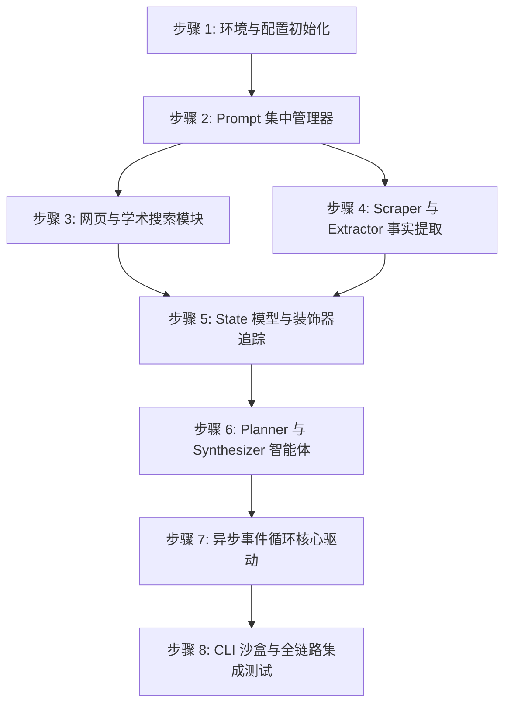

# 第一阶段：后端 Agent 核心执行计划 (Execution Plan)

本执行计划根据 [phase1_backend.md](file:///Users/nam/Documents/agent/deep-research/docs/design-docs/phase1_backend.md) 拆分，将第一阶段的开发划分为 **8个独立、短小、便于验证的执行步骤**。

---

## 任务概览与依赖关系



---

## 步骤 1: 环境与配置初始化
* **目标**: 搭建 Python 开发环境，配置依赖，确保 API Key 能正常读取。
* **修改/新建文件**:
  * [NEW] [backend/requirements.txt](file:///Users/nam/Documents/agent/deep-research/backend/requirements.txt)
  * [NEW] [backend/app/config.py](file:///Users/nam/Documents/agent/deep-research/backend/app/config.py)
  * [NEW] [backend/.env](file:///Users/nam/Documents/agent/deep-research/backend/.env) (开发环境密钥配置)
* **执行步骤**:
  1. 创建 `backend` 虚拟环境并激活。
  2. 编写 `requirements.txt`，包含 `fastapi`, `uvicorn`, `httpx`, `zhipuai`, `tavily-python`, `PyYAML`, `pydantic`, `pytest`。
  3. 编写 `config.py`，使用 Pydantic BaseSettings 载入 `OPENAI_API_KEY` 和 `TAVILY_API_KEY`。
* **验证方式**:
  * 创建一个临时的测试脚本 `test_env.py`，导入所有依赖库，并打印配置中的 API 密钥掩码。
  * **验证指令**:
    ```bash
    python -c "from app.config import settings; print('OPENAI:', settings.OPENAI_API_KEY[:4] + '***' if settings.OPENAI_API_KEY else 'Missing')"
    ```

---

## 步骤 2: Prompt 集中管理器
* **目标**: 实现集中管理 Prompt，并提供动态插值格式化渲染功能。
* **修改/新建文件**:
  * [NEW] [backend/app/prompts/prompts.yaml](file:///Users/nam/Documents/agent/deep-research/backend/app/prompts/prompts.yaml)
  * [NEW] [backend/app/prompts/manager.py](file:///Users/nam/Documents/agent/deep-research/backend/app/prompts/manager.py)
* **执行步骤**:
  1. 编写 `prompts.yaml`，录入各个 Agent (Planner, Extractor, Synthesizer) 的 system/user prompt 模版。
  2. 实现 `manager.py` 中的 `PromptManager` 类，包含 `load()` 加载 yaml，以及 `get_prompt(agent, type, **kwargs)` 返回格式化后的字符串。
* **验证方式**:
  * 编写单元测试，验证参数渲染和缺失参数错误处理。
  * **验证指令**:
    ```bash
    python -m pytest tests/test_prompts.py
    ```
  * **预期结果**:
    系统正确读取 YAML，当传入 `get_prompt("planner", "user", topic="量子计算", breadth=3)` 时，输出包含“量子计算”且分支度为3的字符串。

---

## 步骤 3: 网页与学术搜索模块
* **目标**: 封装 Tavily 网页搜索和 arXiv / Semantic Scholar 学术检索，完成 Search Router 编写。
* **修改/新建文件**:
  * [NEW] [backend/app/search/tavily_client.py](file:///Users/nam/Documents/agent/deep-research/backend/app/search/tavily_client.py)
  * [NEW] [backend/app/search/academic_client.py](file:///Users/nam/Documents/agent/deep-research/backend/app/search/academic_client.py)
  * [NEW] [backend/app/search/router.py](file:///Users/nam/Documents/agent/deep-research/backend/app/search/router.py)
* **执行步骤**:
  1. 封装 Tavily API 异步客户端，获取包含 title, url, content 的结果列表。
  2. 封装 arXiv 学术搜索，返回论文的摘要和 URL。
  3. 编写 `SearchRouter`，根据 Query 关键词实现二分类路由（网页 vs 学术）。
* **验证方式**:
  * 编写测试用例 `tests/test_search.py`。
  * **验证指令**:
    ```bash
    python -m pytest tests/test_search.py
    ```
  * **预期结果**:
    测试脚本断言 “Machine learning algorithm” 路由到学术搜索，“最新科技新闻”路由到 Web 搜索，搜索接口均能返回正确的结构化数据列表。

---

## 步骤 4: Scraper 与 Extraper 事实提取
* **目标**: 实现高价值网页的内容异步抓取与正文清洗，结合 GLM-5.2 提取结构化事实事实。
* **修改/新建文件**:
  * [NEW] [backend/app/agents/scraper.py](file:///Users/nam/Documents/agent/deep-research/backend/app/agents/scraper.py)
  * [NEW] [backend/app/agents/extractor.py](file:///Users/nam/Documents/agent/deep-research/backend/app/agents/extractor.py)
* **执行步骤**:
  1. 在 `scraper.py` 中编写正文提取逻辑：优先使用 Jina Reader API `https://r.jina.ai/{url}`，备用方案使用 `httpx` + `BeautifulSoup` 清洗。
  2. 在 `extractor.py` 中，调用 GLM-5.2 解析文本，根据 `prompts.yaml` 提取事实笔记（包含 `fact` 和 `evidence`）。
* **验证方式**:
  * 传入一段包含混合噪声的测试 HTML 文本（如带有广告标签），验证 Scraper 能成功清洗出纯文本；然后调用 Extractor 解析，验证输出格式符合 Pydantic 定义。
  * **验证指令**:
    ```bash
    python tests/test_extractor.py
    ```

---

## 5 步骤 5: State 模型与装饰器追踪
* **目标**: 编写 Pydantic 数据模型，实现装饰器捕获工具调用详情，并追加至全局 State。
* **修改/新建文件**:
  * [NEW] [backend/app/core/state.py](file:///Users/nam/Documents/agent/deep-research/backend/app/core/state.py)
  * [NEW] [backend/app/core/tracker.py](file:///Users/nam/Documents/agent/deep-research/backend/app/core/tracker.py) (工具和 LLM 调用的追踪装饰器)
* **执行步骤**:
  1. 编写 `state.py`，声明 `ToolCallRecord`, `LLMIOLog`, `FactNode`, `ResearchState` 模型。
  2. 编写 `track_tool_call(tool_name)` 异步装饰器，自动计算运行时长、捕获参数与返回值，自动记录到 `state.tool_calls`。
  3. 编写 `track_llm_io(agent_name, prompt_name)` 装饰器，记录输入、输出和 Token 计数。
* **验证方式**:
  * 编写单元测试 `tests/test_tracker.py`。
  * **验证指令**:
    ```bash
    python -m pytest tests/test_tracker.py
    ```
  * **预期结果**:
    装饰器包裹的异步测试函数执行后，`state.tool_calls` 自动增加一条记录，且字段包括函数参数和执行耗时。

---

## 步骤 6: Planner 与 Synthesizer 智能体
* **目标**: 实现规划智能体（生成多维子方向）与合成智能体（根据提取的事实集，按章节生成最终的报告）。
* **修改/新建文件**:
  * [NEW] [backend/app/agents/planner.py](file:///Users/nam/Documents/agent/deep-research/backend/app/agents/planner.py)
  * [NEW] [backend/app/agents/synthesizer.py](file:///Users/nam/Documents/agent/deep-research/backend/app/agents/synthesizer.py)
* **执行步骤**:
  1. 在 `planner.py` 中通过 GLM-5.2 解析输入课题，生成大纲结构。
  2. 编写启发式深化接口 `refine_and_expand()`。
  3. 在 `synthesizer.py` 中编写多级大纲汇总与最终 Markdown 格式报告的拼装生成。
* **验证方式**:
  * **验证指令**:
    ```bash
    python tests/test_planner_synthesizer.py
    ```
  * **预期结果**:
    大纲生成结构完全契合 JSON schema。报告文本带有明确的 Markdown 标题，符合 Inline 引用标注。

---

## 步骤 7: 异步事件循环核心驱动
* **目标**: 编写 `loop.py`，调度 Planner、Searcher、Scraper、Extractor、Synthesizer 串行与并行执行，完成深度和广度递归控制。
* **修改/新建文件**:
  * [NEW] [backend/app/core/loop.py](file:///Users/nam/Documents/agent/deep-research/backend/app/core/loop.py)
* **执行步骤**:
  1. 编写核心控制类 `AsyncResearchLoop`。
  2. 实现基于 `asyncio.gather` 的子方向并发检索与事实提取。
  3. 实现深度层级递归退出判断。
  4. 实现报告生成并存回 State。
* **验证方式**:
  * 编写模拟测试 `tests/test_loop.py`，用 Mock 模型替换真实的 GLM API。
  * **验证指令**:
    ```bash
    python -m pytest tests/test_loop.py
    ```

---

## 步骤 8: CLI 沙盒与全链路集成测试
* **目标**: 整合所有核心模块，编写控制台沙盒测试脚本，完整走通从“输入课题”到“生成 Markdown 报告与日志 JSON”的全流程。
* **修改/新建文件**:
  * [NEW] [backend/test_cli.py](file:///Users/nam/Documents/agent/deep-research/backend/test_cli.py)
* **执行步骤**:
  1. 编写命令行交互式 CLI。
  2. 执行完整的深度研究流程（设置为 depth=2, breadth=2）。
  3. 将运行日志实时打印至控制台终端。
  4. 将生成的 Markdown 报告保存到 `output/report.md`，将状态 JSON 日志保存到 `output/state.json`。
* **验证方式**:
  * **验证指令**:
    ```bash
    python test_cli.py --topic "2026年量子计算硬件发展与基准测试" --depth 2 --breadth 2
    ```
  * **预期结果**:
    1. 终端打印详尽的搜索、阅读、抽取步骤。
    2. 本地成功生成 `output/report.md` 且内容格式完整，引用了 arXiv 及 Tavily 的搜索源。
    3. `output/state.json` 包含详细的模型 I/O 数据和工具调用记录。
