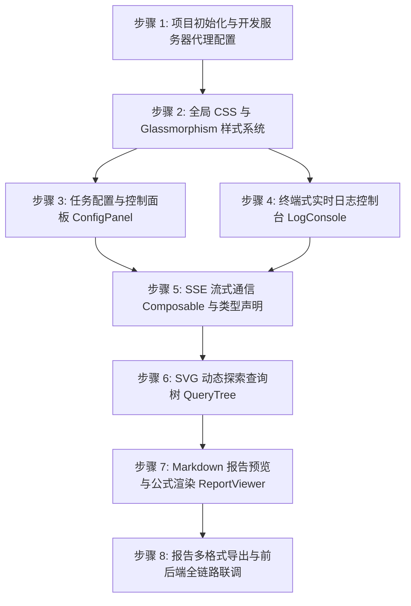

# 第三阶段：前端高颜值 Web 客户端执行计划 (Execution Plan)

本执行计划根据 [phase3_frontend.md](../design-docs/phase3_frontend.md) 拆分，将第三阶段的前端开发划分为 **8个独立、易于开发与联调的步骤**，以便逐步构建和测试高颜值的 Glassmorphism 客户端。

---

## 任务概览与依赖关系

---

## 步骤 1: 项目初始化与开发服务器代理配置
* **目标**: 使用 Vite 初始化 Vue 3 + TypeScript 模板，并配置 Vite 反向代理以解决前后端跨域开发问题。
* **修改/新建文件**:
  * [NEW] [frontend/package.json](../../frontend/package.json) (初始化前端依赖)
  * [NEW] [frontend/vite.config.ts](../../frontend/vite.config.ts) (配置代理 `/api`)
  * [NEW] [frontend/tsconfig.json](../../frontend/tsconfig.json) (TS 编译配置)
* **执行步骤**:
  1. 使用 `npm create vite@latest frontend -- --template vue-ts` 初始化项目（若允许直接运行命令）或手工编写基础配置文件。
  2. 安装 `marked`、`katex`、`lucide-vue-next` 等关键依赖库。
  3. 配置 `vite.config.ts` 中的 `server.proxy`，将 `/api` 的请求代理至 `http://127.0.0.1:8000`。
* **验证方式**:
  * 运行 `npm run dev` 确保前端服务成功启动。
  * 访问本地页面，并在浏览器 Console 中验证代理是否就绪。

---

## 步骤 2: 全局 CSS 与 Glassmorphism 样式系统
* **目标**: 编写基础重置样式及磨砂玻璃、夜间模式所需的 CSS 变量和全局样式。
* **修改/新建文件**:
  * [NEW] [frontend/src/assets/base.css](../../frontend/src/assets/base.css) (排版规范)
  * [NEW] [frontend/src/assets/theme.css](../../frontend/src/assets/theme.css) (CSS 变量与磨砂面板定义)
  * [MODIFY] [frontend/src/main.ts](../../frontend/src/main.ts) (引入上述样式)
* **执行步骤**:
  1. 编写 `base.css` 进行移动端与宽屏基础 reset，并设定全局 Outfit/Inter 字体。
  2. 编写 `theme.css`，定义 `--glass-bg`、`--glass-blur`、`--glass-border` 等变量，实现玻璃面板 `.glass-panel` 及玻璃输入框 `.glass-input` 样式。
* **验证方式**:
  * 在 [App.vue](../../frontend/src/App.vue) 中渲染一个临时玻璃面板 and 输入框，观察背景虚化与渐变色是否生效，并测试 Hover 和 Focus 的发光过渡动画。

---

## 步骤 3: 任务配置与控制面板 ConfigPanel
* **目标**: 编写左侧的控制面板组件，支持用户配置课题、深度、广度并下发开始/停止请求。
* **修改/新建文件**:
  * [NEW] [frontend/src/components/ConfigPanel.vue](../../frontend/src/components/ConfigPanel.vue)
* **执行步骤**:
  1. 使用 Vue 的 `v-model` 绑定多行 `textarea`，输入研究主题。
  2. 添加 Depth 滑条（1-5级）与 Breadth 滑条（1-10级）。
  3. 编写搜索模式单选按钮组。
  4. 实现“开始”与“停止”按钮的交替展示，并实现带有 CSS 流体渐变过渡的 Loading 效果。
* **验证方式**:
  * 编写单元测试或在 UI 中直接操作滑条，确认各项表单的值能实时双向同步，且限制规则和按钮禁用态完全符合设计。

---

## 步骤 4: 终端式实时日志控制台 LogConsole
* **目标**: 编写控制台日志展示组件，支持终端排版、自动随新滚动、手动滚动锁定以及日志分级展示。
* **修改/新建文件**:
  * [NEW] [frontend/src/components/LogConsole.vue](../../frontend/src/components/LogConsole.vue)
* **执行步骤**:
  1. 编写黑客终端风格的日志容器，渲染每一行包含时间戳和消息的日志。
  2. 通过监听容器的 `scroll` 事件计算是否处于触底状态。如果用户手动向上滚则锁定自动滚动，并显示悬浮追随按钮。
  3. 编写过滤器按钮（如 Verbose 详情、Metrics 性能指标、State 步骤）。
  4. 使用 HTML5 `
` 构建可折叠的代码高亮渲染块。
* **验证方式**:
  * 使用前端 Mock 机制每秒向日志数组中 Push 一条新日志，验证组件能顺畅自动滚动且手动锁定机制工作正常。

---

## 5 步骤 5: SSE 流式通信 Composable 与类型声明
* **目标**: 声明核心 TypeScript 类型，编写 Composition Hook 用于同 FastAPI SSE 通信，维护实时日志与指标。
* **修改/新建文件**:
  * [NEW] [frontend/src/types/index.ts](../../frontend/src/types/index.ts)
  * [NEW] [frontend/src/composables/useSSE.ts](../../frontend/src/composables/useSSE.ts)
* **执行步骤**:
  1. 对齐后端 Pydantic 数据格式，在 `types/index.ts` 中声明 `ResearchState` 及其关联的 `FactNode`、`ToolCallRecord` 等。
  2. 在 `useSSE.ts` 中封装 `EventSource`，针对 `'log'`、`'state_update'`、`'complete'`、`'error'` 绑定事件接收处理器。
  3. 实现断线、心跳异常判断和清理资源的 `closeSSE()`。
* **验证方式**:
  * 编写 Mock 后端接口，或者在前端利用 Mock 事件驱动 useSSE，检查 stateLogs 数组和 depth / sources / facts 指标是否能够稳定响应并递增。

---

## 步骤 6: SVG 动态探索查询树 QueryTree
* **目标**: 开发用于展示 Planner Agent 子课题分裂与探索过程的 SVG 树状图，配有渐变圆圈与连线动画。
* **修改/新建文件**:
  * [NEW] [frontend/src/components/QueryTree.vue](../../frontend/src/components/QueryTree.vue)
* **执行步骤**:
  1. 编写 SVG 渲染区域，根据当前 `search_history` 和课题的深度/广度层级自动计算节点坐标。
  2. 使用 Vue 模板遍历生成节点圆圈 `<circle>` 和连线 `<line>`。
  3. 使用 CSS 动画设置 `stroke-dasharray` 动效让线条表现为“生长”效果。
  4. 为 `Searching` 态节点添加光圈呼吸闪烁动画，为已完成节点提供浮动事实卡片。
* **验证方式**:
  * 在 UI 中点击 Mock 按钮新增层级节点，验证图形渲染不重叠，连线正常生长，圆圈渐变显示正确。

---

## 步骤 7: Markdown 报告预览与公式渲染 ReportViewer
* **目标**: 开发精美的学术报告预览组件，支持 Markdown 实时高亮、KaTeX 公式转译和行内引用卡片浮现。
* **修改/新建文件**:
  * [NEW] [frontend/src/components/ReportViewer.vue](../../frontend/src/components/ReportViewer.vue)
* **执行步骤**:
  1. 引入 `marked` 对生成的 Markdown 文本进行 HTML 解析渲染。
  2. 引入 `katex`（包括 CSS），拦截 LaTeX 公式标签，将公式排版成高精度的渲染元素。
  3. 捕获文档中的 `[1]` 等 inline 引用元素，添加 hover 监听器，调出带有玻璃材质的引用摘要 Popover 卡片。
* **验证方式**:
  * 加载一份包含复杂 Markdown 和公式块（例如波恩近似、二阶偏微分方程、代码块）的测试文档，确保没有渲染错乱，且 Hover 引用提示响应迅速。

---

## 步骤 8: 报告多格式导出与前后端全链路联调
* **目标**: 编写导出辅助工具，处理 A4 打印样式，并在完整的前后端集成环境中跑通真实任务。
* **修改/新建文件**:
  * [NEW] [frontend/src/utils/exporter.ts](../../frontend/src/utils/exporter.ts)
  * [MODIFY] [frontend/src/App.vue](../../frontend/src/App.vue) (全版面联排与状态整合)
* **执行步骤**:
  1. 在 `exporter.ts` 中实现 Markdown 和 HTML 的 Blob 下载逻辑。
  2. 在 `base.css` 中增加 `@media print` 样式规则，剔除多余组件，将 `ReportViewer` 的高度和溢出属性配置为适合原生浏览器打印。
  3. 启动 FastAPI 后端服务，并在前端输入研究主题，点击运行，开启控制台观察流式数据吞吐直至生成报告。
* **验证方式**:
  * **测试步骤**:
    1. 输入 `"大语言模型智能体状态管理技术现状与发展趋势"`。
    2. 点击“开始探索”，脑图生成首层节点，控制台持续输出搜索日志。
    3. 到达深度 2 后开始合成，右侧顺利渲染排版精美的 Markdown。
    4. 点击导出 PDF，呼出系统打印对话框，页面布局完美自适应于 A4 纸张排版。
