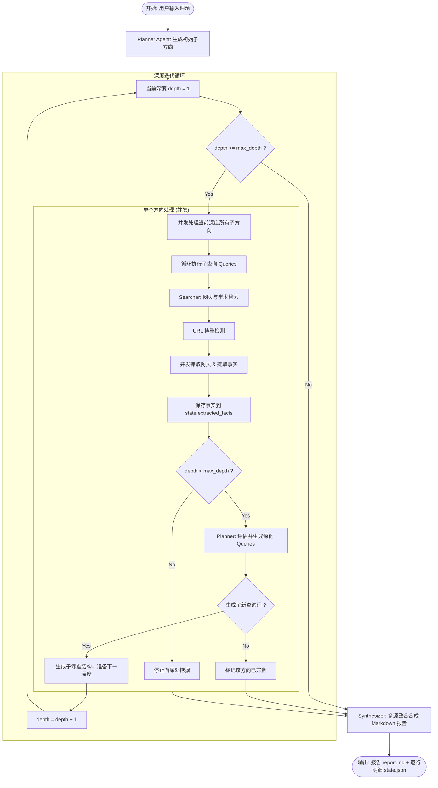

# 后端规格说明书: 异步递归事件循环机制 (Async Event Loop)

本规格说明书详细讲解了 `AsyncResearchLoop` 事件循环的控制算法、递归深化流程以及多路并发控制，这是智能体“深度研究”的核心逻辑。

---

## 1. 递归执行算法流图



---

## 2. 核心机制详解

### 2.1 并发调度 (`asyncio.gather`)
为了保证系统的研究效率，避免由于线性网络请求造成响应过慢，在以下几个关键节点采用并发运行：
1. **多子课题并发 (`recursive_explore`)**:
   在大纲规划完成后，深度为 `d` 的所有子课题方向会并发启动：
   ```python
   tasks = [self.explore_single_topic(topic, current_depth) for topic in topics]
   await asyncio.gather(*tasks)
   ```
2. **多链接抓取提取并发 (`explore_single_topic`)**:
   针对搜索引擎召回的高价值网页链接，系统并发执行“抓取 -> 提取”级联任务：
   ```python
   scrape_tasks = [self.scrape_and_extract_facts(sub_topic, query, result) for result in search_results]
   await asyncio.gather(*scrape_tasks)
   ```

### 2.2 防重入与去重控制 (Deduplication)
深度研究过程中，不同的子查询可能会召回相同的网页。为防止重复下载、相同提示词重入消耗 Token，系统设立双重去重机制：
1. **查询词去重**: 搜集器启动时，先判定 `query in state.search_history`，若已被检索过则立即跳过。
2. **抓取 URL 去重**: 设立内存 `set()` `self.scraped_urls` 记录已抓取过的 URL。并发进行页面刮取前，判断 `url not in self.scraped_urls`。

### 2.3 递归的收敛与终结判定
递归探索的终止由以下三个条件（满足其一即可）决定：
1. **深度溢出终止**: 当前迭代深度超过了 `state.max_depth`。
2. **查询词耗尽终止**: 规划器或细化器返回的检索查询词（queries）为空。
3. **事实完备性收敛**: `PlannerAgent.refine_and_expand` 通过已有事实评估，发现已无核心盲区，返回空的深化搜索词。
