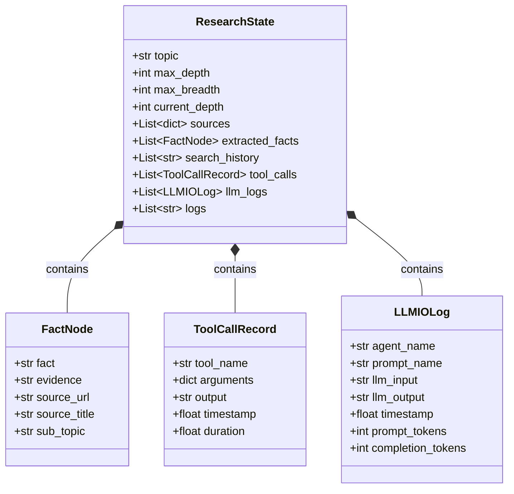

# 后端规格说明书: 数据状态模型 (State & Data Models)

本规格说明书定义了“自动化深度研究智能体”核心状态及元数据的结构定义。整个状态基于 `pydantic` 进行严格类型校验，确保其高度契合 JSON 序列化规范，可以直接作为 REST API 或 SSE 实时推送的 Payload。

---

## 1. 实体关系图

---

## 2. 字段明细与设计考量

### 2.1 ToolCallRecord (工具调用审计)
记录智能体内部所调用的每一个外部工具（如搜索引擎检索、网页 HTML 抓取与提取等）的调用细节。

* **字段列表**:
  * `tool_name` (str): 工具标识名（如 `tavily_search`, `fetch_webpage`）。
  * `arguments` (dict): 工具被调用时的入参。位置参数以 `args` 数组保存，关键字参数以 `kwargs` 字典保存。
  * `output` (str): 工具返回的最终结果。为避免大文本撑爆内存，输出上限被截断为 `3000` 字符。
  * `timestamp` (float): 工具调用的 Unix 时间戳。
  * `duration` (float): 工具执行的实际耗时（单位：秒）。

### 2.2 LLMIOLog (模型对话日志)
用于对大模型（GLM-5.2）进行行为审计与测试调优。

* **字段列表**:
  * `agent_name` (str): 发起请求的智能体标识（如 `planner`, `extractor`, `synthesizer`）。
  * `prompt_name` (str): 发起请求的 Prompt 意图（如 `generate_plan`, `extract_facts`）。
  * `llm_input` (str): 实际拼接并发送给模型的最终 Prompt 文本（包含 System Prompt 和渲染后的 User Prompt）。
  * `llm_output` (str): 大模型返回的原始未经处理的文本/JSON 字符串。
  * `timestamp` (float): 发起请求的 Unix 时间戳。
  * `prompt_tokens` (int): 消耗的输入 Token 数量（来自模型 API 的 usage）。
  * `completion_tokens` (int): 消耗的输出 Token 数量（来自模型 API 的 usage）。

### 2.3 FactNode (事实提取节点)
智能体从各个参考文档中提炼出的高置信度学术/网页知识点，是最终报告合成的核心材料。

* **字段列表**:
  * `fact` (str): 大模型提炼的单条客观事实描述。
  * `evidence` (str): 原始文档中支持该事实的支撑论据、精确段落或具体数据，用于供用户进行追溯核验。
  * `source_url` (str): 事实所处的源网页/论文链接。
  * `source_title` (str): 源网页/论文的标题。
  * `sub_topic` (str): 该事实所对应的规划子课题标题。

### 2.4 ResearchState (研究任务全局状态)
全局单例状态，负责追踪单次研究的完整轨迹与阶段状态。

* **字段列表**:
  * `topic` (str): 用户的原始研究总课题。
  * `max_depth` (int): 最大允许探索的递归深度（Depth）。
  * `max_breadth` (int): 最大允许探索的并发子查询及检索结果数量（Breadth）。
  * `current_depth` (int): 智能体当前运行所处的深度，默认为 0。
  * `sources` (list): 已抓取的全部 URL 列表及摘要元数据：`[{"title": ..., "url": ..., "content": ...}]`。
  * `extracted_facts` (list): 已提炼出的全部 `FactNode` 列表。
  * `search_history` (list): 已搜索过的所有查询词（Query）的历史列表，防止由于递归引发相同的查询词重入。
  * `tool_calls` (list): 全部发生的工具调用审计记录列表。
  * `llm_logs` (list): 全部的 LLM 输入输出原始对话记录列表。
  * `logs` (list): 系统步骤文字日志，用于前端以终端滚动日志的形式进行实时状态展示。
